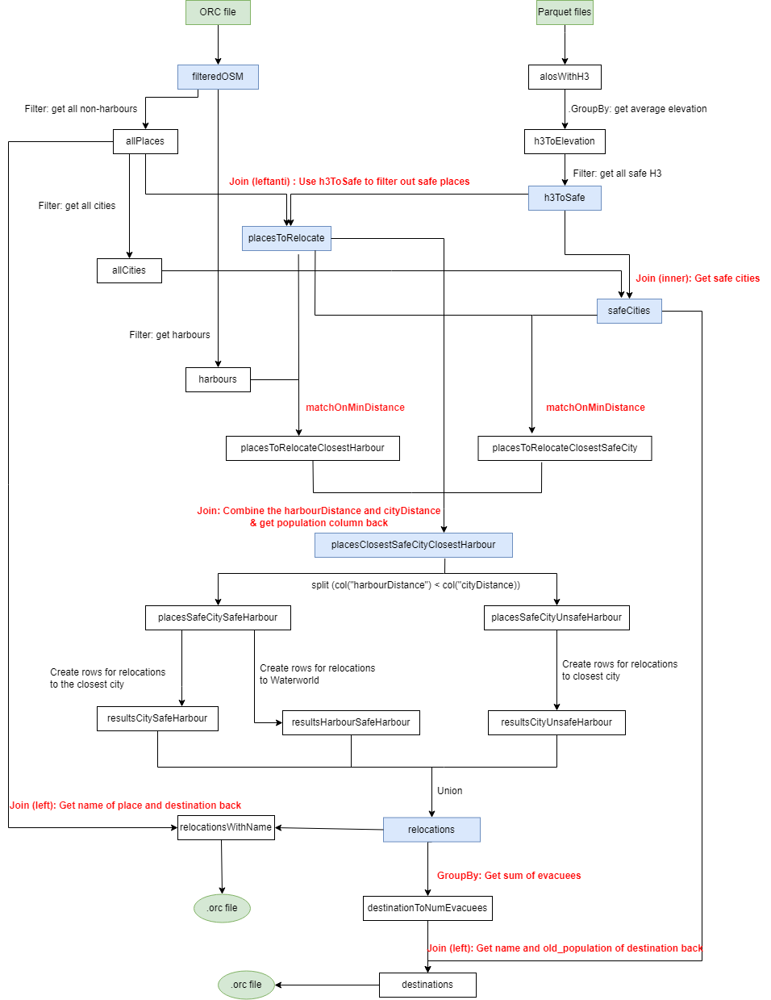
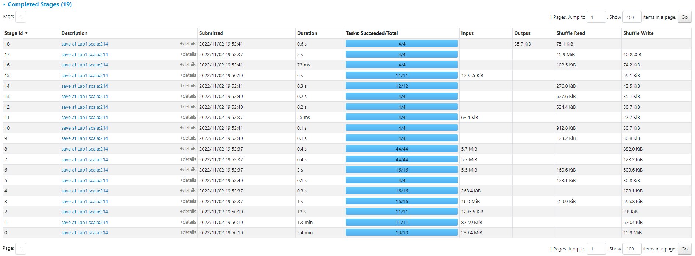

# Lab 1 Report

## Usage

Edit the variables in the script [./adaptiverun.sh](./adaptiverun.sh), and run it:

```bash
$ bash ./adaptiverun.sh
```

The results will be in a folder with a randomly generated ID. 

## Functional overview

### Step 1: Loading the datasets and reading the sea level parameter
- We want to be as type-safe as possible and avoid as much runtime errors as we can. To this end, we 've declared two case classes, `ALOSData` and `Nodes`, to represent the types of the fields in the ALOS and OSM datasets respectively. We also entirely avoid SQL command strings and use only the Spark SQL API functions.
- We then proceed to load the data from the files into the dataframes. We have optimized this process through particular configuration settings.
  - For the OSM dataset, we only need a subset of the rows in our program. Therefore, we add a filter to get all data we need while reading, and use `filterPushdown` to `true`. This setting prevents the program from loading rows that are not necessary for the program to run. Therefore, the result of reading the ORC file is immediately a filtered version, called `filteredOSM`.
  - For the ALOS dataset, we are unable to use `filterPushdown` (in a 
    non-approximating solution) because to filter out the elevations we do not 
    need, we would need the H3s from the ORC files before starting to read. This would make reading the parquet files dependent on reading the ORC, creating a sequential process, which is much slower.
- The sea level is read from the application as a command-line positional argument.

### Step 2: Getting the elevation of places of interest
- We want the average altitude for our places of interest. To get this information, we have to join with the ALOS dataset. However, such a join is ineffective (if not impossible at all) because it assumes that each latitude-longitude combination of the one is present in the other, and represented from the exact same values of double precision. To make this join possible, we use the h3 spacial index library, which translates latitude-longitude combinations to strings, given a specific "resolution" parameter that specifies the granularity of the resulting hexagon-grid.
- Therefore, we enrich both the `osm` and `alos` dataframes with an `h3` column that contains the spacial index of each.
- We filter the `filteredOSM` dataframe to get the places of interest (cities, towns, villages, hamlets, harbours) into `allPlaces`. Note that this effectively only filters out the harbours.
- We group-by the `alos` dataframe to find the average elevation of each hexagon, and then split this dataframe according to our sea level to two sets, one with the hexagons below the sea level and one above, denoted `h3ToRelocate` and `h3ToSafe` respectively.

### Step 3: Getting the places that need to be relocated and the distances to safe cities
- Next, we inner-join the two resulting sets from the previous step with the cities/towns/villages/hamlets and cities only sets respectively, to get:
  1. The places we need to relocate (`placesToRelocate`)
  2. The safe cities (as relocation destinations) (`safeCities`)
- For finding the closest safeCity for each placeToRelocate, we created an abstraction called `matchOnMinDistance`:
  - This function takes two datasets, both having a lat and lon column. It performs a cross-join on these datasets and calculates the distance between each (lat, lon) from the first dataset and the (lat, lon) from the second dataset. We can then simply groupBy (on the specified column `groupByColumn`) to find the minimum distance for every (lat, lon) pair in the first dataset. Note that we do need the auxiliary information from the datasets, so we perform an inner join on the cross-join dataset and the result of the groupBy to regain the auxiliary information. In this case, this means that we do a join again to get the name of the safeCity of which the (lat, lon) coordinates had the minimum distance to the placeToRelocate.
- We call the resulting dataset `placesToRelocateClosestSafeCity`.

### Step 4: Joining the harbours
- We get the `harbours` dataset from the `filteredOSM` dataset, and again do the `matchOnMinDistance` on the `placesToRelocate` and `harbours` to get a dataset with each placeToRelocate and their distance to the closest harbour.
- Intermezzo: Note that there are several optimizations possible here. Since this step is not a bottleneck (<1 second runtime) we have not implemented these for lab 1. The optimizations are: 
  1. We do not actually need the find the minimum distance harbour, we just need to know if there is any harbour in the cross-join that has a smaller distance than the closest safeCity. However, as of now finding the minimum distance between the placeToRelocate and the safeCity and the placeToRelocate and the closest harbour are two parallel processes. This optimization would create a dependency from the latter on the former. We expect that at some size of the datasets, this sequential process will be faster. Hence, we defer this hypothesis to lab 2.
  2. For each placeToRelocate, you could create an upper bound for the minimum distance between a safeCity or harbour. This would allow us to decrease the size of the cross-join dataset, because we can filter out pairs of (lat, lon) where the horizontal or vertical difference is already larger than the upper bound of the minimum distance. In other words, using the upper bound, we could use the triangle inequality to filter out (lat, lon) pairs for which we do not even have to calculate the distance, because it will be too large anyway. 
     - Such upper bounds can be found by performing the `matchOnMinDistance` process on a subset of the second dataset. The minimum distance resulted from this subset will be an upper bound for the minimum distance resulted from the whole second dataset.
- We call the resulting dataset `placesToRelocateClosestHarbour`.

### Step 5: Combining the results
- We combine our results by creating a dataset called 
  `placesClosestSafeCityClosestHarbour` (pardon the lengthy name), which 
  basically contains the placeToRelocate and the distance to the closest 
  city `cityDistance` and the distance to the closest harbour 
  `harbourDistance`. In addition, we re-add the population column again by 
  joining with `placesToRelocate`. We did not need the column during the 
  previous shuffles, so to save time reading and writing this column during 
  the shuffles, we simply omitted the column there and re-add the column now.
- We can then split (using our abstraction `split`) this dataset into the placesToRelocate that have a smaller harbourDistance than cityDistance and those that do not, resulting in `placesSafeCitySafeHarbour` and `placesSafeCityUnsafeHarbour` respectively.

### Step 6: Calculating the relocations 
- The final `relocations` set comes from the union of three sets:
  1. From `placesSafeCitySafeHarbour` we take 75% of the population of these places and put them in the set `resultsCitySafeHarbour`,
  2. and the remaining 25% to `resultsHarbourSafeHarbour` with destination `Waterworld`.
  3. From `placesSafeCityUnsafeHarbour`, we simply take 100% of the population.
- We then calculate the union of these into `relocations` with columns `place`, `num_evacuees` and `destination`, we write the frame into an .orc file.

### Step 7: Calculating the destinations
- Finally, we create the `destinations` set. We perform a group-by and sum operation on `destination` on the `relocations` dataset, along with a left join with the cached `safeCities` set from previously (to get the `old_population`). A simple element-wise addition results in the `new_population`.
- Note that we perform a `na.fill(0)`, because Waterwold is not a city in `safeCities`, so we set its `old_population` to zero.
- We then write the frame into an .orc file. 

### Optimizations
We performed several optimizations to speed up our program. 
1. We minimized the amount of columns during shuffles. Unless a column is necessary during the next computation, we drop it from the dataset, and do a join later in the DAG to regain this column. Since we are dealing with relatively small datasets where the join is not particularly expensive relative to retaining the column throughout the shuffles, we found that this sped up our overall running time.
2. We cache datasets that are used more than once, so that the cache is used instead of recomputing the dataset from the ORC or parquet files. You can recognize these datasets by having multiple outgoing arrows in the diagram. We made some exceptions, which are the datasets which are uncostly to recompute like those resulting from filters. For example, `allPlaces` can be computed very quickly from the already cached `filteredOSM`, so it would be a waste of memory to cache this dataset as well.    
3. Changing the number of partitions. We have discovered the options `spark.
   default.parallelism`, `spark.sql.shuffle.partitions`. The former 
   configuration is the default number of partitions for an RDD. The latter 
   is the number of partitions created when shuffling data for joins or 
   aggregations. We found that our application sped up once we set these values to a low number. The 
   default values are the number of cores in your system and 200 
   respectively. The reason behind the speed up is the fact that the size of 
   the data is quite small, and therefore the overhead of managing a 
   partition becomes greater than the processing necessary for such a 
   partition. To illustrate, splitting the data up into 200 
   partitions to create 200 * 200 = 40.000 tasks is quite 
   unnecessary given that all of these tasks do not even take a millisecond 
   to process. 
   See the measurements section for the optimization of these values.  
4. `filterPushdown` as described above.
5. We experimented with several other configurations, like `spark.sql.hive.metastorePartitionPruning` and `spark.sql.parquet.columnarReaderBatchSize`, but found no statistically significant increases or decreases in overall running time.
6. We do not calculate the full euclidian distance. We ignore the square 
   root and use only the sum of squares because it yields the same results 
   (taking the square root preserves the monotonically increasing structure 
   of the euclidean distance metric) 
   and it is faster to compute this way.

### Some notes on the code
In an effort to make the code more organized, we tried to spot patterns that we could put into functions to avoid repetition. Thus, we created three scala objects:
  1. [UDF](./src/main/scala/UDF.scala) - contains the user-defined functions for our Spark SQL queries
  2. [Cacher](./src/main/scala/Cacher.scala) - utility for keeping track of cached datasets
  3. [API](./src/main/scala/API.scala) - contains functions that wrap patterns of operations we use on dataframes, such as splitting dataframes based on some condition.
  4. [ArgumentParser](./src/main/scala/ArgumentParser.scala) - robustly unpacks the necessary arguments. 

### Solution Figure
Our complete solution containing the intermediary datasets is summarized in 
the figure below. We have denoted the input data with green, our cached 
datasets with blue, and wide dependency throughout the process as red. As a 
small note, we used `matchOnMinDistance` in the figure; this function 
actually does 3 shuffles. 


## Result
 
An excerpt of the output of the program for sea level value 2 is shown below.
We do not really have any "improvements" so to speak, since we have not made 
any assumptions/approximations. We randomly sampled rows from our output 
sets to check whether they were correct, and found no incorrect rows. 

### Output of the program for sea level value 2

#### Relocations set


| place         | num_evacuees | destination |
|---------------|--------------|-------------|
| De Zandloper  | 101          | Alkmaar     |
| Nieuwkoop     | 6873         | Amsterdam   |
| Sint Jansteen | 2373         | Middelburg  |
| ...           | ...          | ...         |
| Tirns         | 42           | Waterworld  |
| Uitwijk       | 261          | Tilburg     |
| Edam          | 5310         | Amsterdam   |
| Spanga        | 154          | Zwolle      |
| Ens           | 2216         | Zwolle      |


#### Destinations set

| destination      | old_population | new_population |
|------------------|----------------|----------------|
| Amsterdam        | 841282         | 1045017        |
| Tilburg          | 199128         | 206790         |
| 's-Hertogenbosch | 115903         | 118483         |
| ...              | ...            | ...            |
| Breda            | 150008         | 316380         |
| Assen            | 66895          | 67561          |
| Emmen            | 56113          | 90849          |


## Scalability
In our code we have only used Spark.SQL functions to create our output. 
Hence, all of our operations are parallelized. While optimizing the code, we 
focused on making sure that during a shuffle the minimal amount of columns 
are used. This implicitly also has the result that we optimized the 
concurrency between different stages. For example, initially we calculated 
the `placesToRelocateClosestSafeCity` dataset, and then used that to 
calculate the closest harbours. However, to calculate the harbours we do not 
need the name of the closest city, or the closest-city distance (cityDistance), 
so we separated calculating the closest-harbour distance and the 
closest-city distance, making it very parallelizable. In short, we found 
that focussing on minimizing the data shuffled was a very good heuristic for 
optimizing the parallelization of our program as well. 

In addition, we adhered to the rule that any wide dependency needs to be 
pushed back in the DAG as much as possible. This rule is based on the intuition 
that if there is space for your wide dependency to be pushed back, e.g. 
there is some filtering or other non-wide processing you can do, then your wide 
dependency is not optimal and the running time could be improved. 

_To give an example of our train of thought: to push back the join resulting in 
`placesToRelocate`, you would need to create the cartesian
product of `allPlaces` x `allCities`. You can not do `matchOnMinDistance` on
this dataset, because the closest city might be an unsafe one (and then you 
would have to redo `matchOnMinDistance`). Hence, it would be
necessary to perform the join with `safeH3` at this point to filter out
rows with safe places and unsafe cities. However, this approach has created a
much larger cross-join than our own implementation. Hence, doing the join to 
create `placesToRelocate` first is optimal._ 

With this in mind, 
we evaluated for every single join whether it could be pushed back, 
and for each we came to the conclusion that there were no more optimal 
alternatives. 
Therefore, we believe our current implementation is close to the 
optimal implementation, since we have considered every alternative on a 
case-by-case basis.

We have added an explanation behind each necessary shuffle in the code itself.

## Performance

Experiments were done on a HP ZBook Studio G4 with the processor Intel(R) Core
(TM) i7-7700HQ CPU @ 2.80GHz, 2808 Mhz, 4 Core(s), 8 Logical Processor(s).
The presented running times are averages of 2 runs each. The maximum 
difference between the 2 runs with the same configuration was 0.1 minutes. 
The runs were all done on the same sea level rise of 2. 

| (default parallelism, shuffle partitions) | Running time (minutes) |
|-------------------------------------------|------------------------|
| (4, 4)                                    | 2.5                    |
| (4, 8)                                    | 2.6                    |
| (4, 16)                                   | 2.7                    |
| (8, 4)                                    | 2.5                    |
| (8, 8)                                    | 2.6                    |
| (8, 16)                                   | 2.6                    |
| (16, 4)                                   | 2.6                    |
| (16, 8)                                   | 2.6                    |
| (32, 4)                                   | 3.2                    |
| (32, 8)                                   | 3.3                    |
| (32, 16)                                  | 3.5                    |
| (32, 32)                                  | 3.6                    |


There are no statistically significant differences in running time once we set default 
parallelism and shuffle partitions below 8, because, as we will see later, 
reading the parquet file takes up most of the running time. Spark forces the 
amount of tasks in this reading stage to be 10 anyway. The other RDDs 
throughout our DAG are partitioned according to the settings, but the 
difference in running time is negligible. Therefore, the running times are 
very similar for low values for the default parallelism and shuffle partitions.
Once we increase the settings to 32, we start to see a more notable overhead,
because now the system has to (unnecessarily) manage more tasks. 

Below is a screenshot of the running times of all the different stages in 
our implementation for a setting of 4 and 4.



Evidently, reading the parquet files takes up the bulk of our running time. 
In fact, we found that once we used a box of coordinates around the 
Netherlands to be used as a pushdown filter while reading the parquet files, 
this stage reduced to at most 1 minute, but we refrained from doing so in 
the final version of our code because it is not generic. 

The only operation that takes more than a second that is not a reading 
operation, is our matchOnMinDistance stage to find the closest city. The 
fact that this stage takes the longest of the non-reading stages is because 
it creates a cartesian product between two datasets, which is a costly 
operation because the resulting dataset's size is the sizes of the sets 
multiplied, and all of this data needs to be red and written. 

Lastly, with the exception of the filteredOSM dataset, all of our datasets 
are below 10MB, which is the threshold for Spark to use a broadcast join. 
These are generally very fast, because we simply send the small dataset across 
the network to all different worker nodes to join it with a larger dataset. 
So, the fact that we minimized the size of our datasets prevents costly 
operations like sort-merge joins. 