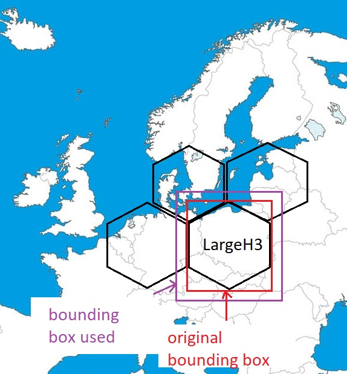
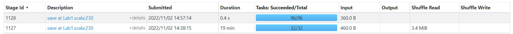
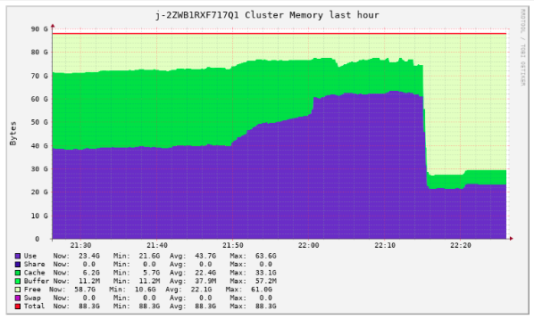

# Lab 2 Report: Group 2 vs. parquet files

## Usage

Edit the variables in the script [./adaptiverun.sh](./adaptiverun.sh), and run it:

```bash
$ bash ./adaptiverun.sh
```

## Approach


### Iteration 0: Baseline

|||
|---|---|
| System                  | AWS EMR |
| Workers                 | 10 x c3.xlarge (40 cores total) |
| Dataset                 | Planet |
| Run time <br>(hh:mm:ss) | 05:30:00 |


Clearly, reading the parquet files is the main  bottleneck of our
application, and takes up 5.2 hours of the 5.5 hour total runtime. Hence,
for this lab we aim to reduce this runtime. One thing we noticed during Lab 1
was the fact that the runtime of reading the parquet files was reduced
significantly once we created a box of coordinates in which all the places
in the Netherlands were located. Through the filter pushdown we were able to
filter out a lot of obsolete ALOS data that did not match any place in the
Netherlands anyway. Note that we did not add this "optimization" to our Lab
1 because the optimization is not dynamic, but rather the result of offline
preprocessing. However, inspired by this, we aim to apply a pushdown filter to the parquet
files another way.


### Iteration 1: Elevation filter
 Therefore, our first iteration was to add an elevation 
filter. More specifically, we only read rows where the elevation was higher 
than the SLR - 1 (SLR = Sea Level Rise). Note that we subtract one meter of the 
SLR. This is to account for H3 tiles with variable elevation, because 
it could be the case that an H3 tile has some coordinate above the SLR, but 
does not have an average elevation above the SLR. With the minus one, we 
create a buffer and also include elevations that might bring the average 
elevation below the SLR. Hence, we basically assume that the set of H3 tiles with an average elevation higher or equal 
the SLR is equal to the set of H3 tiles with an average elevation higher or 
equal the SLR given only the elevations above SLR - 1. 

Note that we enter the realm of approximation, given that there could 
theoretically be a place that was falsely flagged as safe. We ran this 
optimization on the Netherlands with a SLR of 2, and found no 
performance improvement in reading the parquet files. In addition, we had 10 
falsely-flagged safe cities. Hence, we have not included this optimization 
in the final lab 2 code.

### Iteration 2: Bounding boxes for the Parquet files 
We note that the performance improvement of using the elevation filter is 
limited because of the fact that the parquet files are sorted on latitude 
and longitude instead of elevation. Therefore, we expect a large performance 
improvement if we could introduce a pushdown filter based on latitude and 
longitude. We aim to achieve this by extracting suitable bounding boxes from 
the ORC files. A bounding box is simply a tuple (max-latitude, min-latitude, 
max-longitude, min-longitude) that can be used to filter out all rows with 
latitude and longitude not inside these ranges. 

#### Iteration 2a: Matching on H3
In this iteration, we try to use the unique H3's from the ORC files and only 
read the rows of the parquet files where the H3 is present in the ORC files. 
Intuitively, you would do this with a join, but to do that you would have to 
first read every single row. Besides, a join creates a shuffle. Therefore, 
we refrain from using join. The second option becomes to collect the list of 
unique H3's and then place these in a pushdown filter with the 
`isInCollection` functionality of Spark. Unfortunately, to do this, Spark 
needs to calculate the H3 first, which requires reading all the rows anyway, 
thus having no performance improvement. 

#### Iteration 2b: Bounding boxes of H3
Therefore, we look at the H3 API and find a function called `cellToBoundary`,
which takes in an H3 address and produces a set of coordinates representing 
the boundary of the H3 tile. This would allow us to prevent Spark from having to 
read every single row, and instead directly filter on the latitude and 
longitude. We extract the top, bottom, left and right coordinates of the 
bounding box of each H3 tile and use it to produce a condition for the 
filter. We then reduce the set of conditions with the OR clause to get a 
single filter that should theoretically allow us to read the relevant ALOS 
data only. Unfortunately, Spark treats the OR and AND operator as a binary 
operator, and thus each condition adds a function to the stack. 
Unsurprisingly (in hindsight), we get a StackOverflowError when using our 
constructed filter.

#### Iteration 2c: Reducing the amount of bounds 
Therefore, we aim to reduce the amount of bounds to prevent the 
StackOverflowError. We find that the H3 grid is hierarchical in the sense 
that each H3 has a single parent H3 of a resolution smaller than the 
standard resolution of 8. We exploit this finding by performing iteration 2b 
again on the list of unique H3 tiles of resolution 4. Fortunately, we get no 
StackOverflowError anymore, but notice no significant performance increase. 
We are quite sure this is because of the fact that our filter is still quite 
complex with a lot of stacked OR and AND clauses, which prevents Spark from 
optimizing our filter pushdown. Anyway, we also notice that this is of no 
use because the world dataset will have much more H3's of resolution 4 as 
well. In fact, we find that there are 128 H3 tiles in the world with 
resolution 0. Given we get around 26 tiles (20%, which we assume is the 
amount of habited H3 tiles of resolution 0,
of the 128 H3 tiles of resolution 0), we would still have a very complex 
query and would therefore get the same effect of no 
performance improvement.
We further tried to reduce the amount of bounds by recursively merging the 
bounding boxes if they were next to each other, but this still resulted in 
too much boxes. Besides, if we reduce the amount of boxes too much (by 
merging them together), then our reading will not be fine-grained anyway which reduces the performance 
improvement anyway.

#### Iteration 2d: Reading in UDF 
Since we can not use one large filter for one single read, perhaps we can and do multiple reads,
each using one simple filter. Our first approach was to create a 
UserDefinedFunction (UDF) that takes in a "large H3" (H3 string with a low 
resolution) and calculates the set of safe "small H3" (H3 tiles with 
resolution 8). This UDF would convert the large H3 to a bounding box, read 
the ALOS data with a pushdown filter using the bounding box, and 
subsequently return the small H3 with an average elevation higher or equal 
to the SLR. Unfortunately, we were confronted 
with the fact that reads are not allowed inside UDF's, because the UDF's are executed 
on worker nodes instead of the driver node. These worker nodes do not have 
access to the spark context so that reading files inside the UDF is impossible. 

At this point we lost hope.

#### Iteration 2e: Sequentially reading
With our final breath in the battle against the parquet files, we again collect 
the list of large H3's. Since we can not read the parquet files with 
different filters concurrently (as tried with the UDF), we finally submit 
ourselves to a sequential approach. We loop through the collected list of 
unique large H3's, get the bounding boxes with `cellToBoundary` and read the 
ALOS data for each bounding box. Each of our iteration reads some subset 
of the ALOS data, and is union-ed with the ALOS data that was read 
previously. The key realization we made here was that reading the ALOS data 
from a single, large enough bounding box is already enough work for all the 
cores to be  utilized. Therefore, reading the parquet files still happens 
optimally fast, but now that we use the bounding boxes, filter pushdown is 
finally effective. 

#### Iteration 2f: Why stop there? Sequentially processing everything 
Having re-established our affection for Spark, we made the
observation that we could also simply perform all of our computations within 
this for-loop. In other words, we process the world one large H3 tile at the 
time, creating the result ORC files per large H3 tile (to reiterate, a large H3 is 
an H3 tile with low resolution, typically 0, 1 or 2. A resolution of 2 would 
mean that reading the parquet files would be fine-grained with very precise 
bounding boxes, but we decrease the amount of work per iteration. This means 
that at some resolution we would be decreasing concurrency. On the other hand, 
a resolution of 0 would mean that reading the parquet files would be sloppy 
with very rough bounding boxes, but the amount of work per iteration would be 
large so that concurrency remains optimal).
Ironically, this improvement simply consisted of copy-pasting our code 
inside the loop with some small adjustments.
These small adjustments were: 
1. The `placesToRelocate` at each iteration are those that have the large H3 
   equal to the large H3 we are considering. 
2. However, the closest safe city or safe harbour could be in another large 
   H3 if the `placeToRelocate` is close to the border of the bounding box. 
   Therefore, the candidate safe cities and candidate harbours are those in 
   the large H3 we are considering and its neighbours. We get the 
   neighbouring large H3 tiles with a call to `gridDisk(largeH3, k=1)` of
   the H3 API. Fortunately, we do not have to consider all candidates from 
   these neighbour tiles, only those close to the border of their respective tile. 
   So, we simply increase our bounding box with 1 in every direction (e.g. the 
   right coordinate for the longitude increases with 1). We then calculate
   the safe small H3 tiles from the ALOS data within the bounding box. 
   **At this point we realized that we have not only sped up reading the 
   parquet files, but the computation as a whole, because we are only 
   joining datasets with coordinates very close to each other, so all the 
   joins (including the very expensive cross-joins) are much less costly.**
3. At the end of each iteration (so after writing the ORC files), we can 
   uncache all datasets that are relevant for this iteration only. The same 
   reasoning as above is also applicable here: our cached datasets are much 
   smaller now that we are only joining datasets with coordinates very close 
   to each other. 

**Note that we do introduce an assumption here, namely that the closest 
harbour and closest safe city is at most 2 "distance" away so *(lat1 - lat2)
^2 + (lon1 - lon2)^2 <= 2*.**

<sub><sup>
The image below shows how we process the world map (Note we used pentagons 
instead of hexagons because of Microsoft Paint). Inside the indicated 
LargeH3, we identify all the places that need to relocate. We identify all 
the possible safe cities and harbours inside the
indicated purple bounding box. Once we finished processing this 
LargeH3, we write the results to their respective folders and continue with the next LargeH3. </sup></sub>



We ran our code on the Netherlands data set first with a resolution of 1 for 
the LargeH3 and a SLR of 12 on a HP ZBook Studio G4 with the processor Intel(R)
Core (TM) i7-7700HQ CPU @ 2.80GHz, 2808 Mhz, 4 Core(s), 8 Logical Processor
(s). This gave a runtime of 5.0 minutes, which is much more than our runtime 
from Lab 1. We observe that this is because the Netherlands has three 
LargeH3 with resolution 1, which results in us processing 3 LargeH3. However,
recall that our bounding boxes were increased with 1 to account for 
relocations from and to different largeH3. This results in overlapping 
bounding boxes, so that we actually read more parquet data with the 
Netherlands setting. 

We were still confident that running time would improve on planet because we 
are able to read the elevations more fine-grained. Hence, we ran on the 
planet with SLR 12 and LargeH3 resolution 1. Unfortunately, after 4 hours we 
read the intermediate results (since it writes after processing each largeH3)
, and we found out that it only processed 10% of the world. Once we 
inspected the Spark History server, we found a lot of variance in the time 
it takes to process one LargeH3, but find no definite reason behind the 
variance. For example, processing 460 bytes at some point took 19 minutes.
In addition, every time we try to read the parquet files, Spark causes a call to 
`listLeafFiles`, which takes anywhere between 5 to 10 minutes. We had no 
time to find the reason behind the variances in running time. 



### Iteration 3: Back to Lab 1 
After we found out about the variability in running times of AWS, we did some 
other runs to find some sort of average running time. These are listed below. 

|||
|---|---|
| System                  | AWS EMR |
| Workers                 | 4 x c4.xlarge (16 cores total) |
| Dataset                 | Planet |
| Run time <br>(hh:mm:ss) | 12:00:00 |

|||
|---|---|
| System                  | AWS EMR |
| Workers                 | 10 x c4.xlarge (40 cores total) |
| Dataset                 | Planet |
| Run time <br>(hh:mm:ss) | 04:14:00 |

A running time of 12 hours with 16 cores total roughly corresponds to a running 
time of 4.8 hours with 40 cores. By averaging the runs, we conclude that our 
running time on planet is about 4.8 hours. 

## Summary of application-level improvements

1. Introduced a pushdown filter on elevation to only read the rows with an 
   elevation higher or equal to SLR - 1. **Not applied.**
2. Process the world sequentially per "large" H3 tile, assuming that the 
   corresponding bounding box contains both the closest safe city and the 
   closest safe harbour, if there is one. **Not applied.**
3. We resort to the optimizations of Lab 1, which does not make use of any 
   assumptions. Hence, the code for Lab 2 is exactly the same as the code for 
   Lab 1. 
 
## Cluster-level improvements

### Memory

Initially we speculated that since we are using caching on large datasets, we probably require lots of memory, so we used the memory-optimized `m4.xlarge` instances for our cluster.

We noticed however from the Ganglia UI that we ended up using around half of the total memory in our cluster:



So, in the runs after that, we used CPU-optimized `c4.xlarge` instances, which have the same amount of v-CPUs but less memory, and we had no issues. This way we had the same results but also reduced the cost of our cluster.

## Conclusion

In short, we have learned to use AWS EMR and the S3 bucket.
The rest of our learning was on how to apply prior knowledge (for example, you 
can expect the closest city to be actually close to the place that needs to be 
relocated, how do you integrate this information in your program?)
to make your system speed up. Unfortunately, all our efforts to speed up our program ended up being futile.
 
