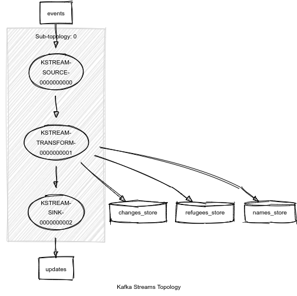

# Lab 3 Report

## Usage

At the project root directory, start the containers in a terminal:
```
$ docker compose up
```
In another terminal start sbt:
```
$ docker compose exec transformer sbt
```
In the sbt shell that opens up, run:
```
sbt:Transformer> run 2
```
Replace `2` with the number of seconds of your choice for the time window

## Functional overview

We followed an incremental approach based on the requirements levels.

### Step 1: Serialization

Before getting started, we made sure we had established proper serialization and type-safety. For that, we used Serde with Circe following the instructions [here](https://github.com/azhur/kafka-serde-scala). The case classes we use to serialize the input and output tuples are named  `Input` and `Output` respectively.

### Step 2: "Good" requirements

Starting with the "good" requirements, we figured we need to transform the elements in the input stream while also keeping state - a simple counter per city ID to keep track of the number of refugees.

While the high-level Kafka DSL has tools to do that, we decided to go for a custom Kafka Transformer using the relatively low-level Processor API, because we wanted to have as much control as possible (for the "excellent" requirements later too).

We chose the Transformer over the Processor because we want to emit exactly one element with each element the stream transformer receives, and the Transformer allows us to do exactly that, while the Processor does not emit elements.

For this implementation, we used an integer to integer map-store in our Transformer, which maps the city ID to the total count of its refugees. On each new tuple-event that arrives, the transformer updates the store by adding the new refugees to the map, and creates a new tuple-event containing the city ID, the city name (which gets from the current tuple) and the current updated refugee count and pushes it downstream.

### Step 3: "Excellent" requirements

In this step, we modified our code to comply with the extra requirements. The most important change is the addition of a scheduled function in the Transformer which we use to define a time-window in our stream. We could have used Kafka's windowing abstractions to keep track of state in time-windows but they are not a great fit for our use-case of delivering zeros when no changes are made to the number of a city's refugees withing the window, so we sticked with the manual low-level function-scheduling approach.

First, we add two more maps-stores to keep track of the names of the cities and the changes in the numbers of refugees in the current time-window given their city IDs. We could not use a single store for all these because we have limited freedom in the types we can use due to the serialization. We can only use primitive types and not tuples etc.

In the `init` method of the Transformer, we schedule a function to run every `x` seconds (`x` is read from the commandline at the program start). Each time this function runs, it dumps downstream the events we want, containing the changes in the numbers of refugees that happened within this time-window. After this dump, it updates the refugees store and zeros the changes-count store.

Upon the arrival of an event from the input stream, the `transform` method of the Transformer is called. During this method, we save the city name if it hasn't been saved already, and we increase the respective counts in the changes-count store. We emit no elements with these updates.

## Kafka topology and setup

The Kafka Streams topology we used in our solution is the following:



Essentially we only use one step in our topology, the Transformer, and it's stateful, since we use state stores to keep track of the cities we have seen so far and their IDs, their names, their number of refugees, and the changes in those numbers in each time window.

## Result

A sample from the output of the program can be found below:

```
...
lab-3-2022-group-02-updates-1           | 1174872	{"city_id":1174872,"city_name":"Karachi","refugees":2462723,"change":0}
lab-3-2022-group-02-updates-1           | 1817993	{"city_id":1817993,"city_name":"Anqing","refugees":201077,"change":0}
lab-3-2022-group-02-updates-1           | 1886760	{"city_id":1886760,"city_name":"Suzhou","refugees":1678791,"change":108}
lab-3-2022-group-02-updates-1           | 2158177	{"city_id":2158177,"city_name":"Melbourne","refugees":1061592,"change":0}
lab-3-2022-group-02-updates-1           | 3530597	{"city_id":3530597,"city_name":"Mexico City","refugees":18747,"change":0}
lab-3-2022-group-02-updates-1           | 3688689	{"city_id":3688689,"city_name":"Bogotá","refugees":1825296,"change":0}
...

lab-3-2022-group-02-events-1            | 1817993	{"timestamp":1666616466305,"city_id":1817993,"city_name":"Anqing","refugees":14}
lab-3-2022-group-02-events-1            | 2158177	{"timestamp":1666616466717,"city_id":2158177,"city_name":"Melbourne","refugees":0}
lab-3-2022-group-02-events-1            | 1886760	{"timestamp":1666616467145,"city_id":1886760,"city_name":"Suzhou","refugees":47}
lab-3-2022-group-02-events-1            | 1817993	{"timestamp":1666616467427,"city_id":1817993,"city_name":"Anqing","refugees":6}
lab-3-2022-group-02-events-1            | 1174872	{"timestamp":1666616467832,"city_id":1174872,"city_name":"Karachi","refugees":257769}
lab-3-2022-group-02-events-1            | 1886760	{"timestamp":1666616468008,"city_id":1886760,"city_name":"Suzhou","refugees":8}

...
lab-3-2022-group-02-updates-1           | 1174872	{"city_id":1174872,"city_name":"Karachi","refugees":2720492,"change":257769}
lab-3-2022-group-02-updates-1           | 1817993	{"city_id":1817993,"city_name":"Anqing","refugees":201097,"change":20}
lab-3-2022-group-02-updates-1           | 1886760	{"city_id":1886760,"city_name":"Suzhou","refugees":1678846,"change":55}
lab-3-2022-group-02-updates-1           | 2158177	{"city_id":2158177,"city_name":"Melbourne","refugees":1061592,"change":0}
lab-3-2022-group-02-updates-1           | 3530597	{"city_id":3530597,"city_name":"Mexico City","refugees":18747,"change":0}
lab-3-2022-group-02-updates-1           | 3688689	{"city_id":3688689,"city_name":"Bogotá","refugees":1825296,"change":0}
...
```

In this sample, we see that for example in the previous time-window Anqing had 201077 refugees, then two events came in the current window with 14 and 6 new refugees, so what we output at the end of this window is the total number of refugees now, 201077 + 14 + 6 = 201097, and the change, which is 14 + 6 = 20.
